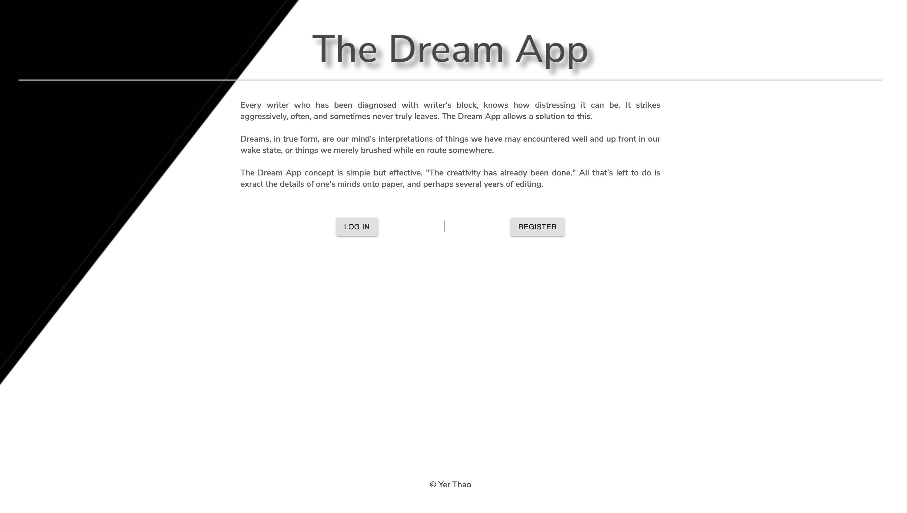

# Solo Project: The Dream App

## Description

_Duration: 2 Week Code Fun

An application where users can store and manage their dreams. The concept of The Dream App is simple but effective in helping writers combat writer's block by allowing them to access their dream details. Upon doing so, they will have creative content to extract inspiration from.  Attributes of dream entries include: title, date, image url, details, and genre selection. Upon adding an entry into the application, user can view all dreams or specified dream upon clicking on choice. This application will safely store users' dreams into a database.

<!-- To see the fully functional site, please visit: [DEPLOYED VERSION OF APP](www.heroku.com) -->

## Screen Shot

 
 

### Prerequisites

Link to software that is required to install the app.

- [Node.js](https://nodejs.org/en/)
- [Postgres](https://www.postgresql.org/download/)

## Installation

1. Create a database named `dream_app`,
2. The queries in the `tables.sql` file are set up to create all the necessary tables and populate the needed data to allow the application to run correctly. The project is built on Postgres, so you will need to make sure to have that installed. We recommend using Postico to run those queries as that was used to create the queries, which can be found in the database.sql file.
3. Open up your editor of choice and run an `npm install`
4. Run `npm run server` in your terminal
5. Run `npm run client` in your terminal
6. The `npm run client` command will open up a new browser tab for you!

## Usage

1. Open application in HTML browser
2. If new user, click on Register, if existing, click on Log In.
3. Once inside, click on Add Dream or View Dreams.
4. Add Dream: input title, date, valid image url, details, and select genre from dropdown menu. Click Submit.
5. View Dreams: Click on any dream image to view specific dream details.
6. Logout when done.

## Built With

* HTML
* CSS
* JavaScript
* Postgres
* Express
* React (Redux)
* Node
* React Redux
* Material-UI
* REST API
* Passport.js

## Media Resources

* Video by Vimeo from Pexels: https://www.pexels.com/video/time-lapse-video-of-milky-way-galaxy-857134/
* Video by Taryn Elliott from Pexels: https://www.pexels.com/video/a-woman-writing-on-a-journal-4596337/

## Acknowledgement
Thanks to [Prime Digital Academy](www.primeacademy.io) who equipped and helped me to make this application a reality. 
Additional, sincere thank you the following:
* Mary Mosman, my Prime instructor
* Vatti 

## Support
If you have suggestions or issues, please email me at [maivyerthao@gmail.com@gmail.com](www.google.com)